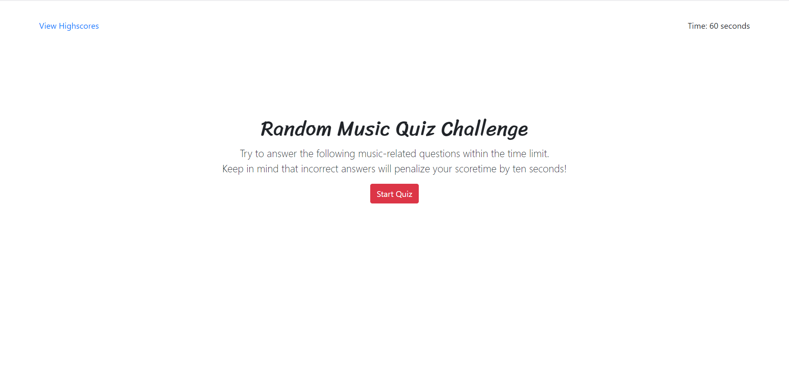

# code_quiz

## Background
The objective of this exercise was to create a quiz that stores high scores.

Acceptance criteria is as follows:

```
GIVEN I am taking a code quiz
WHEN I click the start button
THEN a timer starts and I am presented with a question
WHEN I answer a question
THEN I am presented with another question
WHEN I answer a question incorrectly
THEN time is subtracted from the clock
WHEN all questions are answered or the timer reaches 0
THEN the game is over
WHEN the game is over
THEN I can save my initials and score
```

## Site Pictures


## Approach

There were several key areas to focus on in this project:
1) Creating a visually pleasing, responsive layout
2) Displaying different objects and "screens"
3) Creating a high score list that stores names

### Layout and design

The Bootstrap grid system was used to create and maintain a visually pleasing layout.  Empty columns were placed on both sides of the page to help center content and allow for responsiveness.  Basic elements were also created using Bootstrap (e.g. buttons, forms, etc.).  Google Fonts was used to modify font styles.

Below is a sample of the code written to illustrate grid usage:

```
<!-- question screen -->
    <div class="jumbotron bg-white" id="questionScreen" style="display: none; padding-top: 15%;">
      <div class="container-fluid">
        <div class="row">
          <div class="col-2">
          </div>
          <div class="col-8">
            <h2 id="question" class= "mb-5">Placeholder</h2>
            <p class="lead">
              <a class="btn btn-secondary btn-block mt-2" href="#" role="button" id="answerButton1">Placeholder 1</a><br/>
              <a class="btn btn-secondary btn-block " href="#" role="button" id="answerButton2">Placeholder 2</a><br/>
              <a class="btn btn-secondary btn-block " href="#" role="button" id="answerButton3">Placeholder 3</a><br/>
              <a class="btn btn-secondary btn-block " href="#" role="button" id="answerButton4">Placeholder 4</a>
            </p>
            <div class="border-top" style="display: none;" id="answerResult">
              <span> &#10004; </span> Correct!
            </div>
            <div class="border-top" style="display: none;" id="answerResult2">
             <span>&#10060;</span> Wrong!
            </div>
          </div>
          <div class="col-2">
          </div>
        </div>
      </div> 
    </div>
```


### Displaying objects and "screens"

To give the appearance of switching screens, display: none and display: block were utilized.  These are trigerred by various functions according to whatever action the user is partaking in.  For example, below is the script written to return the user to the start screen from the high score screen.  

```
// returns user to start screen
function goBack(){
    highScoreScreen.style.display = "none";
    startScreen.style.display = "block";
    secondsLeft = 60;
    gameScore = 0;
    questionNumber = 0;
    timeEl.textContent = "Time: 60 seconds";
}
```

### aaa


## Built With

* [HTML](https://developer.mozilla.org/en-US/docs/Web/HTML)
* [CSS](https://developer.mozilla.org/en-US/docs/Web/CSS)
* [Bootstrap](https://getbootstrap.com/)
* [JS](https://developer.mozilla.org/en-US/docs/Web/JavaScript)

## Deployed Link

* [See Live Site](https://cofchips.github.io/code_quiz/#)


## Authors

* **CHRISTOPHER LEE** 

- [Link to Github](https://github.com/CofChips)
- [Link to LinkedIn](https://www.linkedin.com/in/christophernlee/)

## Acknowledgments

